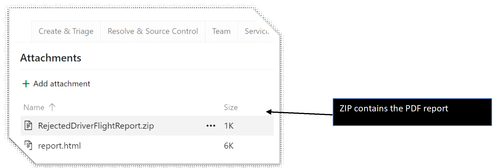
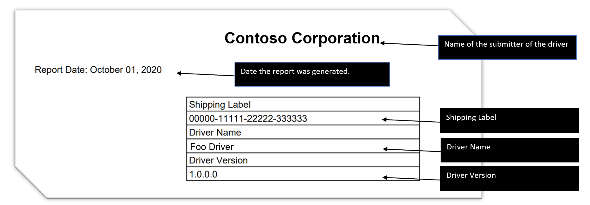
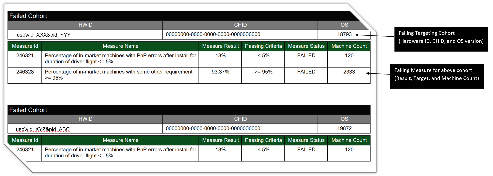

# Cohort Failure Report

Beginning June 15, 2020, Driver Servicing began [evaluating driver quality by targeting cohorts](https://docs.microsoft.com/windows-hardware/drivers/dashboard/overview-of-microsoft-driver-measure-dictionary#evaluating-by-targeting-cohort). To improve on this process, starting October 30, 2020, if your driver is cancelled due to a cohort failure you will start to receive a new report detailing the specifics of the [failure](https://docs.microsoft.com/windows-hardware/drivers/dashboard/overview-of-microsoft-driver-measure-dictionary#evaluating-by-targeting-cohort).

## Location of the Report

When a driver completes flighting, a bug is created and assigned to you, which includes the Decision Snapshot (a report of the state of the measures at the time of flight completion) [report.html in image below]. We will be utilizing that same bug to include the new Cohort Failure Report if the driver is cancelled due to a cohort failure during release monitoring. It will be added to the RejectedDriverFlightReport Zip file as an attachment to that bug. Inside the Zip file, the file name will be Cohort_Failure_Report.pdf.

Figure 1: Screenshot of Bug Attachment with the RejectedDriverFlightReport.zip file attached that contains the new Cohort_Failure_Report.pdf

## How to Read the Report

This report has 3 sections, **Title**, **Summary**, and **Details**, described below.

### Title Section: describes the driver

This section includes the submitter company name, the date the report is generated, the shipping label number, the driver name, and the driver version.

Figure 2: Screenshot of the Title section that includes the submitter company name, report date, shipping label, driver name, and driver version

### Summary section: provides a summary of the action you will need to take

This section includes basic information about what type of analysis was done and what you can do to address the issue.

Figure 3: Screenshot of the Summary section with the summary of the report and action you can take to resolve the problem

### Details Section: provides details about the failures that were found

This section includes details about the failures that were found. The section will repeat for each failing cohort that is found. 

The section first lists a targeting cohort (Hardware ID, CHID, and OS version) where the failure was found. This is followed by the list of measures that failed for that targeting cohort, including:

- The Measure ID (to look it up in the Measure Dictionary and the Flight Report).
- The Measure name
- The result of the measure at the time of the report
- The passing criteria
- The status of the measure
- The number of machines in that cohort that have adopted the driver and were used to calculate the measure.

Figure 4: Screenshot of the Details section that includes each failing targeting cohort and the failing measure details for each cohort
