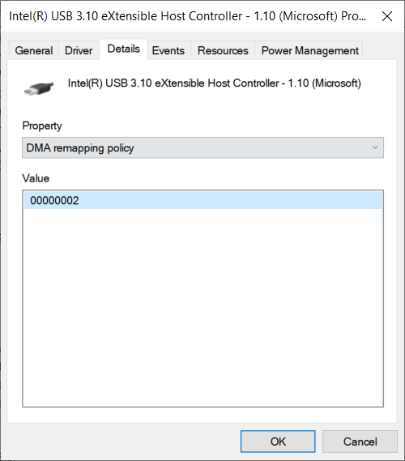

# Enabling DMA Remapping for device drivers

To ensure compatibility with [Kernel DMA Protection](https://docs.microsoft.com/windows/security/information-protection/kernel-dma-protection-for-thunderbolt) and [DMAGuard Policy](https://docs.microsoft.com/windows/client-management/mdm/policy-csp-dmaguard#dmaguard-deviceenumerationpolicy), PCIe device drivers can opt into Direct Memory Access (DMA) remapping.

DMA Remapping for device drivers protects against memory corruption and malicious DMA attacks, and provides a higher level of compatibility for devices. Also, devices with DMA Remapping compatible drivers can start and perform DMA regardless of lock screen status.

On Kernel DMA Protection enabled systems, DMAGuard Policy may block devices, with DMA Remapping incompatible drivers, connected to [external](https://docs.microsoft.com/windows-hardware/drivers/pci/dsd-for-pcie-root-ports#identifying-externally-exposed-pcie-root-ports)/[exposed](https://docs.microsoft.com/windows-hardware/drivers/pci/dsd-for-pcie-root-ports#identifying-internal-pcie-ports-accessible-to-users-and-requiring-dma-protection) PCIe ports (e.g. M.2, Thunderbolt™), depending on the policy value set by the system administrator.

## Driver requirements for enabling and opting into DMA Remapping

1. Drivers perform DMA using the following interfaces:
    * [WDF DMA interfaces](https://docs.microsoft.com/windows-hardware/drivers/wdf/introduction-to-dma-in-windows-driver-framework)
    * [WDM interfaces](https://docs.microsoft.com/windows-hardware/drivers/ddi/wdm/)
    * [NDIS interfaces](https://docs.microsoft.com/windows-hardware/drivers/ddi/_netvista/)
2. To opt into DMA Remapping, specify the following INF directive:

  ```inf
    [MyServiceInstall_AddReg]
    HKR,Parameters,DmaRemappingCompatible,0x00010001,1
    ;1 = opt-in, 2 = opt-in only for external devices
  ```

3. Enable driver verifier when testing the driver.
    * Under driver verifier (for testing purposes), the value of the INF directive for opting in external devices is promoted to 1.
4. Use the latest Windows 10 build with VT-d/AMD-Vi enabled to test driver functionality on Intel x64 and AMD64 systems.

_Note: DMA Remapping is not supported for graphics device drivers._

## Validating that DMA Remapping is enabled for a specific device driver instance

To check if a specific driver has opted into DMA Remapping, look in Device Manager, in the device's **Details** tab, for the values corresponding to the DMA Remapping Policy property. There are three possible values for the Policy in Device Manager:

* 2 = DMA Remapping is currently enforced for the specific device instance.
* 1 = Device driver explicitly opted out of DMA Remapping.
* 0 or DMA Remapping Policy property is not visible = DMA Remapping INF directive is not specified in the INF file. DMA Remapping is not enforced for this device.



>[!NOTE]
> For Windows 10, versions 1803 and 1809, the property field in Device Manager uses a GUID {83da6326-97a6-4088-9453-a1923f573b29}[18]
