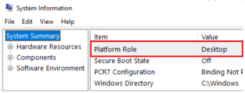

# Known Issues with Client-Side Rendering

Client-side rendering is enabled for all drivers by default, because it is transparent to most printer drivers and provides a definite benefit to the user. Most printer drivers will not experience any problems with this feature enabled.

If the printer driver encounters a problem, however, you can disable the client-side rendering feature and the printer driver will render the print job on the print server like with previous versions of the Windows operating system. System administrators can also disable client-side rendering by using the Always render print jobs on the server group policy.

> [!NOTE]
> If you disable the client-side rendering feature, the print-job rendering will move to the print server, which can adversely affect print server performance.

Printer drivers that are installed in a driver package will not have a problem with client-side rendering.

The following list describes some of the known issues with client-side rendering:

- Client-side rendering is automatically disabled if the printer driver uses a custom print processor but the print processor is not installed on the client computer.

  In some cases, the print processor of a printer driver that is not configured as a driver package might not be installed on the client computer during Point and Print. If the print spooler detects a problem, it will disable client-side rendering for that print queue. To avoid this problem, create a driver package for the printer driver.

- Client-side rendering for the print queue is disabled if the print processor returns an error.

  After client-side rendering is disabled for the print queue, the print spooler retries the print job by using server-side rendering. Note that after client-side rendering is disabled for the print queue, the print queue will no longer have any of the client-side rendering benefits such as offline printing.

- Printer configuration data might be incomplete for printer drivers that use non-standard configuration data.

  Point and Print might not transfer the complete printer configuration data of printer drivers that use proprietary methods for storing and communicating this data. You can fix this problem by using the **SetPrinterData** or **SetPrinterDataEx** function to store printer configuration data and using the **GetPrinterData** or **GetPrinterDataEx** function to recall printer configuration data. For more information about these functions, see the Microsoft Windows SDK documentation.

- Client-side rendering with a driver mismatch.

  A printer driver mismatch exists when the client computer has a different version of the printer driver than the server has. Typically, when a printer driver mismatch occurs, Point and Print updates the printer driver on the client computer to match the printer driver on the server. In some situations, you might want the print queue on the client computer to use a print driver version that does not match the printer driver version on the print server. For example, you might not want Point and Print to update the printer driver on the client computer:

  - If there is a compatibility issue with the printer driver on the print server when run on the client computer.
  - To reduce the network traffic that results when Point and Print downloads the new printer driver.
  - When debugging or testing.

  You can prevent Point and Print from downloading the printer driver and force the client computer to use the best driver that is already installed on the client computer instead. To select this behavior, set the value of the HKLM\\SYSTEM\\CurrentControlSet\\Control\\Print\\*PrinterName*\\PrinterDriverData\\DriverPolicy registry key to the name of the printer driver. Replace *PrinterName* with the name of a print queue to use a locally available printer driver instead of the printer driver that is available from the print server. The driver name that you enter in this registry key must be the name of a compatible printer driver that is installed or available for installation on the client computer.

  You can also create a printer connection with a printer driver mismatch programmatically by calling **AddPrinterConnection2**, setting the PRINTER\_CONNECTION\_MISMATCH flag and specifying the name of the printer driver in the PRINTER\_CONNECTION\_INFO\_1 structure that the *pConnectionInfo* argument references. **AddPrinterConnection2** is documented in the Windows SDK documentation.

- Beginning with Windows 8, client-side rendering is automatically disabled if the EMFDespoolingSetting value is not present in the registry and client machine profile is Mobile platform.

  If the client is a mobile platform such as a laptop or tablet device, to enable saving on power consumption, the spooler automatically disables client-side rendering when this value is not present in the registry. You can enable client-side rendering for mobile platform explicitly in the driver by calling SetPrinterData to set the EMFDespoolingSetting value of the print queue to 0.

  You can confirm whether your machine is configured as a Mobile or Desktop profile by using msinfo32.exe:

  

If, during testing, you detect a problem with your printer driver that the client-side rendering feature might have caused, you can disable client-side rendering for your driver. You can disable client-side rendering in the driver by calling **SetPrinterData** to set the EMFDespoolingSetting value of the print queue to 1. This value will cause any clients that connect to the print queue to render the print jobs on the server.
